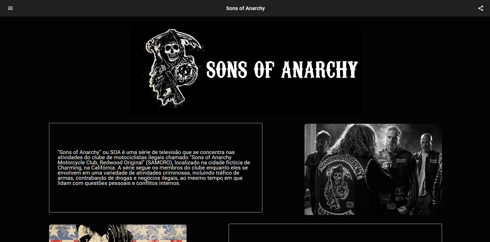

<h1 align="center"> Task 01 - Angular </h1>

<p align="center">
  Task 01 do módulo de Angular<br/>
</p>

<p align="center">
  <a href="#-tecnologias">Tecnologias</a>&nbsp;&nbsp;&nbsp;|&nbsp;&nbsp;&nbsp;
    <a href="#-instalacao-do-projeto">Instalação do projeto</a>&nbsp;&nbsp;&nbsp;|&nbsp;&nbsp;&nbsp;
  <a href="#-sobre-o-projeto">Sobre o Projeto</a>&nbsp;&nbsp;&nbsp;
</p>

<p align="center">
  
</p>

<p align="center">
  <a href="https://ignite-todo-silk.vercel.app/" target="_blank">➡️ Acesse o deploy!</a>
</p>

## 🚀 Tecnologias

Esse projeto foi desenvolvido com as seguintes tecnologias:

- Angular
- TypeScript
- SCSS
- Material Angular

## ⚙️ Instalação do projeto

Passo-a-passo:

1. Caso não tenha, instale a CLI do Angular

```
npm install -g @angular/cli
```

2.Instale as dependências e inicialize o Servidor
```
npm i

ng serve --open
```

## 💻 Sobre o Projeto

O projeto é um site básico de informações sobre a série Sons of Anarchy, onde foram aplicados conceitos base sobre o roteamento, renderização e data-binding simples no Angular 
